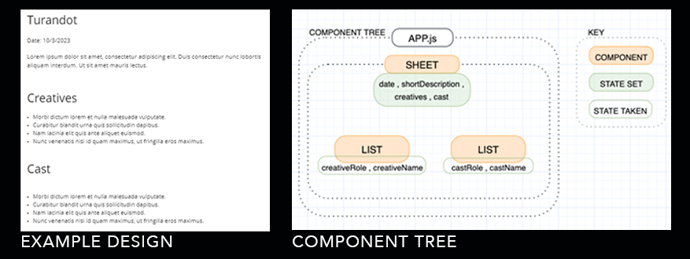
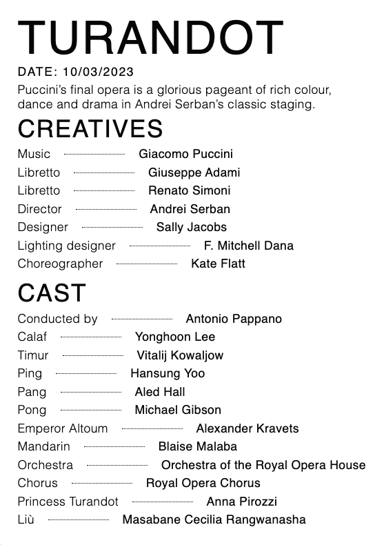

# Cast List Challenge
ROYAL OPERA HOUSE

---

**CONTENTS:**
- [ Documentation ](#docs)
- [ Process Journal ](#journal)
- [ Original Repo & Brief ](https://github.com/royaloperahouse/roh-cast-list-challenge)
- [ Finished App (screenshot) ](#final)

*Thank you very much for reviewing my application and technical challege submission.<br>I've learned a lot along the way, and I'm looking forward to hearing your feedback!<br> - **Mari Lovell***

---

<a name="docs"></a>
# Documentation

## Install
After cloning the repo, run the command `cd roh-cast-list-challenge` to move into the directory.
Next, run `npm i` in the terminal to install the dependencies.

*If CORS policy is preventing the app from running, you can find a browser extension to override it [here](https://chrome.google.com/webstore/detail/moesif-origin-cors-change/digfbfaphojjndkpccljibejjbppifbc#:~:text=Moesif%20Origin%20%26%20CORS%20Changer&text=This%20plugin%20allows%20you%20to,without%20receiving%20Cross%20Origin%20Errors.).*

To start the React App on localhost, run the following commands in the terminal:
```bash
cd turandot-cast-sheet
npm start
```

## Tech Stack
   

<a name="journal"></a>
# Process Journal
*A log of my work process, and the main learning points I've taken from this task.*

---

## 1) Planning & Setup

- **Define the shape of the project** <br>
I started by studying the brief carefully, and reviewing the structure of the JSON object and the example image. I created a component tree to plan the shape of the project and the state flow. I wanted to make the List component reusable to maximise efficiency, and to allow for scalability if any further lists needed to be added at a later date.
I also decided to keep my development process organised with GitFlow for good practice.





---
- **Check out existing resources**<br>
I also took a moment to look at an existing [Cast Sheet](./readme-images/cast-sheets.png) on the ROH website. I found that existing ROH digital Cast Sheets are designed to be viewed by the user on desktop and mobile devices. In the interest of time management, I added responsive styling as a stretch goal into my overall plan.


---

<a name="unittest"></a>
- **Plan a Unit Test**<br>
I wrote a basic unit test in Jest based on the method I was intending to use to render the List component. I wanted to impliment testing as early as possible in the project for Test Driven Development, but I realised I didn't have enough info on the data types I'd be working with to pre-plan the exact processes it would need to take. The unit test became a stretch goal in the interest of time keeping.

---

## 2) DATA & API CALL


- **Set up Fetch request**<br>
When making my first API call via. a Fetch request, I noticed a CORS issue in my browser console. I considered which approach would be preferred: creating a backend with and populating it with the provided data, creating a proxy server to access the API, or using a browser extension to disable CORS. In the interest of time management, I opted for the browser extension, and contacted the HR team to check if ROH had a preferred way of navigating the problem.


- **Test the Fetch request & rendering**<br>
As well as making use of console logs, I checked I was rendering the fetched data correctly by setting up a few of the necessary states, and adding a few essential values into the basic structure of my project. This served as a helpful starting point when referencing some of the deeper nested data objects later on.


- **Find the path to the correct data objects**<br>
When searching the JSON object for the values I needed, I knew that all the data (the cast names and roles for one specific activity) couldn’t be found at the same level. With the link between the date and the cast names being the cast ID, I created a function to filter through the object and collect only the data that met the correct conditions. 

- **MVP achieved!**<br>
With all the correct data in place, here's what the [Minimum Viable Project](./readme-images/mvp-roh.png) looked like.

---

## 3) STYLING & ACCESSIBILITY
<a name="styling"></a>
- **Styling**<br>
I referred to the brief, the example image, and to [existing ROH Cast Sheets](https://www.roh.org.uk/tickets-and-events/40/the-magic-flute-by-david-mcvicar/cast-list/51323) when deciding how to style my project. I happened to find a PDF on [ROH Branding Guidelines](http://static.roh.org.uk/for/pdfs/ROH_GuidelinesSectionA.pdf), and used the recommended [font family, weights, and colours](./readme-images/branding-guidelines-roh.png) wherever possible to add some simple styling, endevouring to match a real-life ROH cast sheet as best I could in the time frame. If I'd had more time, I would have liked to continue improving the styling by adding media queries and controlling the responsiveness of the elements a bit more, as well as improving the alignment of the list items.

- **Accessibility**<br>
I was very keen to ensure my app's accessibility as much as possible throughout the project. Beyond accessible styling choices, such as font readability, contrast levels, and fallback fonts, I took care in using semantic elements wherever possible, giving each element a semantic class name, and using the correct order of heading hierarchy.<br><br>
I was faced with an ARIA challenge when creating the List component, as I wanted to add a dotted horizontal line between two `<p>` tags. I was attempting to style a `<span>` with `border-bottom:dashed` without success, and added a temporary workaround: a string of full-stops ( `<p>.....</p>` ). However, I knew that this was bad practice for screen readers. I did some research on `aria-hidden="true` . Whilst I found that it did work when I implimented it, and produced a perfect score on Lighthouse, my research suggested this method shouldn't be used on focusable elements. After some refactoring, I was able to use `border-bottom:dashed` with a `div` element instead. I really valued this process, and I'm very interested in learning more about the best practices of accessiblity.

---

## 4) REFACTORING & OPTIMISING

- **Tidying up**<br>
I took some time to refactor some helper functions, including formatting the date into the standard UK format. I removed my console logs, any unnessessary state, and made sure my comments were clear and descriptive.

- **Stretch Goals**<br>

    - sameLine function<br>
    I noticed on a real-life ROH Cast Sheet that when two or more people with the same creative role are working on one production, their names are displayed on one line, separated by a comma [(example)](./readme-images/same-role-creatives-roh.png). I would like to refactor my list function to return an element in this format if the same role was present in two places within the object.

    - `dangerouslySetInnerHTML`<br>
    After discovering a few `<p>` tags included in the JSON object, I wanted to know if there was a more efficient method of removing them than the checkTags function I created (removes the first 3 and the last 4 characters of the string if `<p>` is included). I found out about `dangerouslySetInnerHTML`, the React alternative to setting `"innerHTML"`. Implementing this would allow me to display the string whilst running any HTML present within it. As the name "dangerously" suggests, this has some security risks, and I decided not to impliment this until I learn more about it in the near future.
    
    - [Improved Responsive Styling](#styling)
    
    - [Unit Test](#unittest)

<br>
<br>

<a name="docs"></a>
# Finished App



---

*Many thanks again for reviewing my application!*

---
